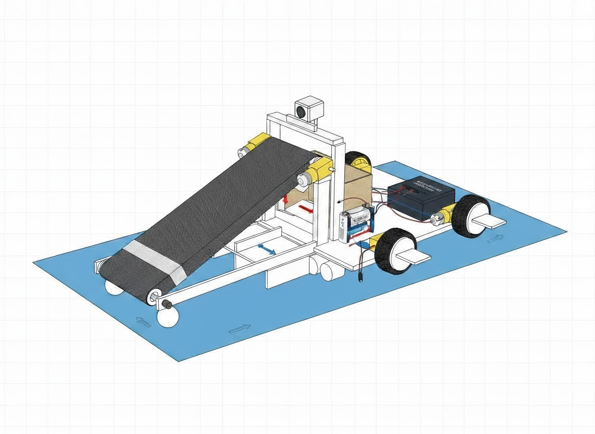
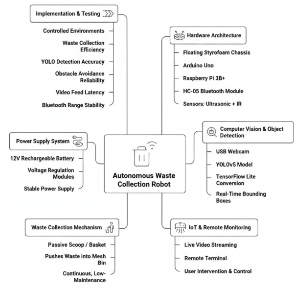
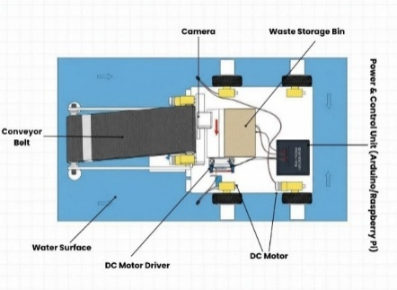
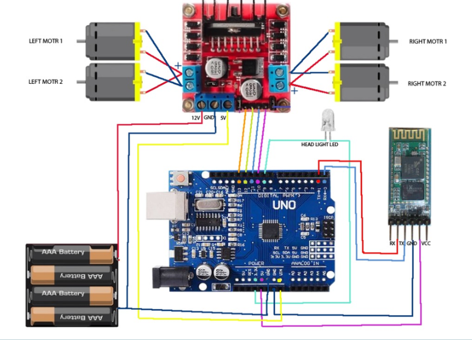
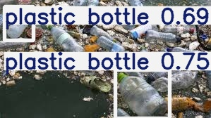

# 🌊 Autonomous Water Surface Cleaning Robot using YOLO-Based Computer Vision
A complete end-to-end implementation of a semi-autonomous robotic platform for floating waste detection and collection using YOLOv5, Raspberry Pi 3, Arduino Uno, and TensorFlow Lite.

<p align="center">
  
</p>

<p align="center">


</p>

---

## 📄 Research Publication

This project has been presented and published as part of the research paper:

> **Autonomous Water Surface Cleaning Robot Using YOLO-Based Computer Vision and Obstacle Avoidance**

**Authors**

Kirti Wanjale, Shreya Khatavkar, Ayush Khatal, Om Kharate, Nandita Kharade, Samarth Khedkar, Shravani Khedekar

**Conference**

International Conference on Emerging Innovations (ICEI 2026)

📚 **IEEE Xplore:** [View Publication](https://ieeexplore.ieee.org/document/11447466)

📄 **ResearchGate:** [View Publication](https://www.researchgate.net/publication/403376911_Autonomous_Water_Surface_Cleaning_Robot_Using_YOLO-Based_Computer_Vision_and_Obstacle_Avoidance)*

If you use this repository for research or academic work, please consider citing the associated publication.

---

## 📑 Table of Contents

- Overview
- Project Objectives
- Key Features
- System Architecture
- Repository Structure
- Getting Started
- Results
- Future Scope

## 📖 Overview

Water pollution caused by floating plastic waste, wrappers, bottles, paper waste and other debris has become an increasingly serious environmental concern. Cleaning ponds, lakes and reservoirs manually is labour-intensive, time-consuming and often exposes workers to contaminated water.

This project presents a **Semi-Autonomous Water Surface Cleaning Robot (AWSCR)** that combines **computer vision**, **embedded artificial intelligence**, and **robotic waste collection** into a compact, affordable and reproducible platform.

Unlike conventional cleaning systems that collect every floating object, the proposed system uses a **custom-trained YOLOv5 model** to detect floating waste while minimizing unnecessary interaction with natural aquatic vegetation such as floating leaves and flowers. This approach helps preserve the ecological balance of water bodies while improving cleaning efficiency.

The robot integrates:

- 🧠 YOLOv5-based floating waste detection
- ⚡ TensorFlow Lite inference on Raspberry Pi 3 Model B
- 📷 USB Webcam for real-time image acquisition
- 🤖 Arduino Uno for motor and actuator control
- 📡 Bluetooth-assisted navigation
- 🚧 Ultrasonic and IR sensor-based obstacle avoidance
- 🗑️ Conveyor belt mechanism for autonomous waste collection

The system is designed as a **low-cost**, **modular**, and **energy-efficient** solution that can be reproduced using readily available hardware and open-source software.

---

## 🎯 Project Objectives

- Detect floating waste using a custom-trained YOLOv5 model.
- Minimize disturbance to natural aquatic vegetation.
- Perform real-time inference on a Raspberry Pi 3 Model B.
- Collect detected waste using a conveyor-based collection mechanism.
- Provide a reproducible, low-cost solution suitable for educational and research purposes.
- Demonstrate an integrated AI + Robotics solution for environmental monitoring and water surface cleaning.

---

## ⭐ Key Features

- Real-time floating waste detection
- TensorFlow Lite deployment on Raspberry Pi
- Lightweight YOLOv5 Nano model
- Arduino-based robot control
- Bluetooth-assisted navigation
- Obstacle avoidance using ultrasonic and IR sensors
- Conveyor belt waste collection mechanism
- Flask-based live video streaming
- Modular architecture for future expansion
- Complete reproducible training and deployment pipeline

---

## 🖼️ Project Overview

<p align="center">
  
</p>

The project consists of five major subsystems:

- Hardware Architecture
- Computer Vision & Object Detection
- Waste Collection Mechanism
- IoT & Remote Monitoring
- Power Supply and Testing

Each subsystem has been designed to work together to create a compact semi-autonomous robot capable of detecting and collecting floating waste efficiently.

---

# 🏗️ System Architecture

The Autonomous Water Surface Cleaning Robot (AWSCR) is designed as a **semi-autonomous embedded robotic platform** that integrates computer vision, embedded AI, motor control, and a conveyor-based waste collection mechanism into a single system.

The architecture is divided into two major components:

- **Hardware Architecture** – Responsible for locomotion, sensing, and waste collection.
- **Software Architecture** – Responsible for object detection, decision-making, and live monitoring.

Together, these components enable the robot to navigate water bodies, detect floating waste, avoid obstacles, and collect debris efficiently.

---

# ⚙️ Hardware Architecture

<p align="center">
  
</p>

The robot is built on a lightweight floating platform designed to operate on ponds, lakes, reservoirs, and other relatively calm water bodies.

The major hardware components include:

| Component | Purpose |
|-----------|---------|
| Raspberry Pi 3 Model B | Executes the YOLOv5 TensorFlow Lite model for real-time object detection. |
| Arduino Uno | Controls motors, sensors, and the conveyor mechanism. |
| USB Webcam | Captures live video frames for object detection. |
| DC Geared Motors | Provide propulsion for robot movement. |
| L298N Motor Driver | Controls the speed and direction of the DC motors. |
| HC-05 Bluetooth Module | Enables manual navigation and control through a mobile device. |
| Ultrasonic Sensor | Detects obstacles in front of the robot. |
| IR Sensors | Assist with obstacle detection and navigation. |
| Conveyor Belt | Collects floating waste and transfers it into the storage bin. |
| Waste Collection Bin | Stores collected waste until it is manually emptied. |
| Li-ion Battery Pack | Powers the Raspberry Pi, Arduino, motors, and sensors. |

The floating chassis is designed using lightweight materials to provide sufficient buoyancy while supporting all electronic and mechanical components.

---

# 🔌 Hardware Connections

<p align="center">
  
</p>

The Arduino Uno acts as the primary controller for all hardware peripherals.

Its responsibilities include:

- Controlling the left and right drive motors.
- Operating the conveyor belt motor.
- Reading obstacle sensor data.
- Communicating with the HC-05 Bluetooth module.
- Executing movement commands received during manual operation.

The Raspberry Pi operates independently for computer vision tasks and communicates the detection results to guide the waste collection process.

---

# 💻 Software Architecture

The software stack consists of multiple layers working together to achieve real-time object detection and robot control.

```
USB Webcam
      │
      ▼
Image Acquisition
      │
      ▼
TensorFlow Lite Inference
(Raspberry Pi 3)
      │
      ▼
YOLOv5 Object Detection
      │
      ▼
Detection Results
      │
      ▼
Robot Navigation &
Waste Collection Decision
      │
      ▼
Arduino Motor Control
      │
      ▼
Conveyor Belt Activation
```

The software architecture separates perception from control.

- **Raspberry Pi** performs all computer vision and inference tasks.
- **Arduino Uno** manages the robot's movement, sensors, and actuators.

This separation reduces computational load on the microcontroller while allowing the Raspberry Pi to focus entirely on AI-based perception.

---

# 🔄 System Workflow

The complete operational workflow is illustrated below.

1. The USB webcam continuously captures frames from the surrounding water surface.

2. Each frame is processed by the YOLOv5 TensorFlow Lite model running on the Raspberry Pi.

3. Floating waste objects are detected and localized using bounding boxes.

4. Detection results are analyzed to determine the presence and location of waste.

5. The robot is navigated towards the detected waste through manual Bluetooth-assisted control while continuously monitoring obstacles using ultrasonic and IR sensors.

6. Once aligned with the waste, the conveyor belt lifts the floating object and deposits it into the onboard storage bin.

7. The processed video stream is simultaneously displayed through a Flask-based live streaming interface for remote monitoring.

---

# 🧠 Design Decisions

Several important design decisions were made during the development of this project to balance performance, cost, and ease of deployment.

### Why Raspberry Pi 3?

The Raspberry Pi 3 Model B provides sufficient computational capability for TensorFlow Lite inference while remaining affordable and widely available.

---

### Why Arduino Uno?

Separating motor control from AI inference reduces processing overhead and simplifies hardware integration.

---

### Why YOLOv5 Nano?

The YOLOv5 Nano model provides an excellent balance between detection accuracy and inference speed on embedded hardware such as the Raspberry Pi 3.

---

### Why TensorFlow Lite?

Running the original PyTorch model directly on the Raspberry Pi is computationally expensive.

TensorFlow Lite significantly reduces:

- Model size
- Memory usage
- Inference time

making real-time deployment feasible.

---

### Why Bluetooth-Assisted Navigation?

Instead of implementing a fully autonomous navigation system, Bluetooth-assisted control allows the operator to safely guide the robot towards waste while the onboard AI handles object detection.

This approach simplifies deployment and increases reliability in dynamic aquatic environments.

---

# 📂 Repository Structure

```
Autonomous-Water-Surface-Cleaning-Robot
│
├── dataset/          # Dataset configuration and download link
├── dependencies/     # TensorFlow Lite Runtime dependencies
├── images/           # Images used in the documentation
├── model/            # Trained models and conversion scripts
├── raspberry_pi/     # Raspberry Pi deployment scripts
├── training/         # Google Colab training notebook
└── README.md         # Project documentation
```

Each folder contains a dedicated `README.md` explaining its purpose and usage in detail.

---

# 🚀 Getting Started

To reproduce this project, follow the folders in the order below:

1. Download the dataset (`dataset/`)
2. Train the YOLOv5 model (`training/`)
3. Export and convert the model (`model/`)
4. Set up the Raspberry Pi (`dependencies/`)
5. Deploy the model (`raspberry_pi/`)

Each step includes detailed instructions in its respective folder.

---

# 📊 Results

<p align="center">
  
</p>

The trained YOLOv5 model successfully detects floating waste in real time and was deployed on a Raspberry Pi 3 Model B using TensorFlow Lite. The lightweight deployment enables efficient inference while maintaining low computational requirements suitable for embedded systems.

---

# 🔮 Future Scope

Possible future enhancements include:

- GPS-assisted autonomous navigation
- Solar-powered operation
- AI-based waste classification and segregation
- Improved obstacle avoidance
- Smart city and IoT integration

---

## ⭐ Support

If you found this project helpful, consider giving this repository a **star**.

If you use this work in your research or academic project, please cite the associated publication.